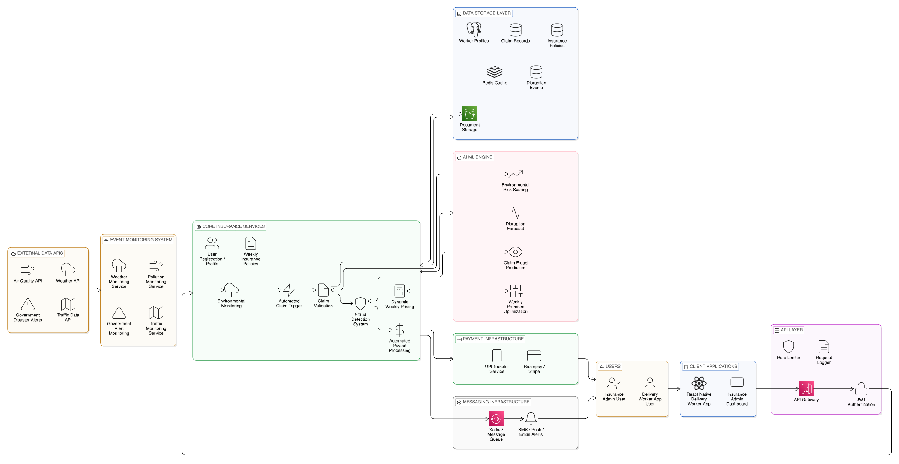
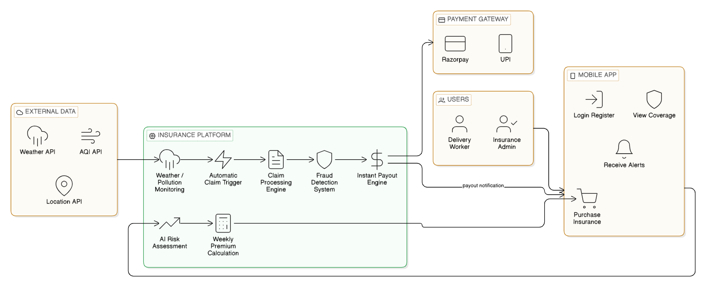
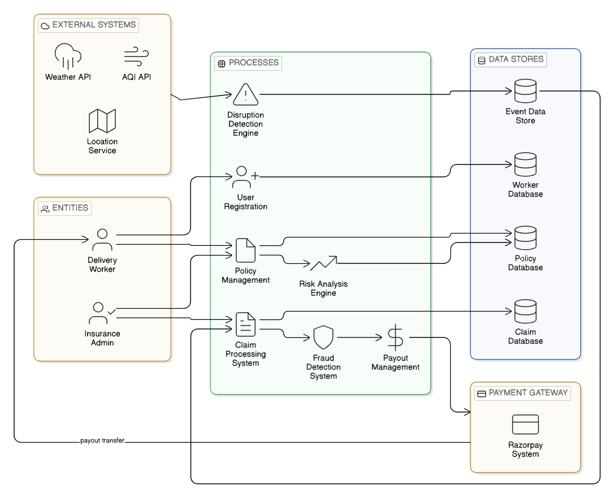
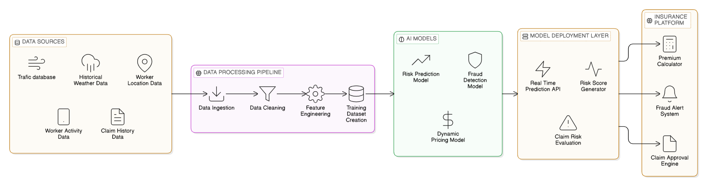
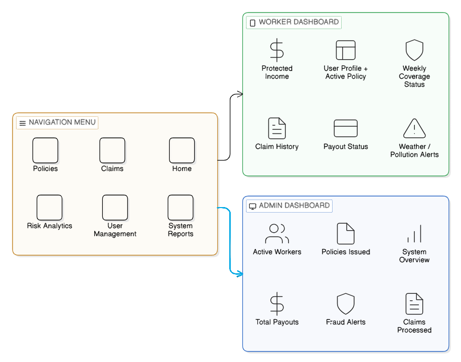

# AI-Powered Insurance Platform for India’s Gig Economy

## Overview

This plan helps delivery workers stay covered when bad weather, pollution, or rules change.

Workers on apps like
 - Zomato,
 - Swiggy,
 - Zepto, or amazon 
rely on daily gigs to earn money. But storms, smog, or new rules can cut their hours and pay.

Now, if a trigger event happens, like a storm or pollution, a claim comes automatically. No need to wait or file forms. It just works when things go wrong.

It seems like a simple way to keep people safe when things change unexpectedly.

---

# Problem Statement

Gig workers often get paid unevenly because things outside their control happen.


- Heavy rainfall
- Extreme heat
- High air pollution
- Floods
- Curfews

That means they lose money each day.
Right now, no insurance covers these issues.

---

# Project Objective

We want to: 
  Help workers keep steady incomeOffer low,
  Cost weekly plansSpot disruptions fastUse simple rules to send claimsStop,
  The fake claims with smart checksPay out money right away


---

# Target Persona

## Food Delivery Worker

Example Persona:

Name: Rahul
Age: 27
City: Bangalore

Works for a food delivery platform such as Swiggy.

Daily income: ₹600
Monthly income: ₹20,000 (after expenses)


### Challenges

- Unstable earnings
- Weather exposure
- Lack of income protection

---

# Insurance Model

It is based on three main insurance concepts.

## 1. Parametric Insurance

First of all, Parametric Insurance uses measurable events (e.g. rainfall exceeding 80 mm) as a trigger for automatic payout without the need for manual claim filing.

Example:

Rainfall > 80 mm → System triggers claim.

No manual claim submission is required.

---

## 2. Micro-Insurance

Secondly, Micro Insurance is affordable insurance designed for gig workers.

| Plan | Weekly Premium | Coverage |
|-----|-----|-----|
| Basic | ₹20 | ₹800 |
| Standard | ₹30 | ₹1500 |
| Pro | ₹40 | ₹2500 |

---

## 3. Weekly Pricing Model

Gig workers earn income on a weekly cycle.

Therefore the insurance premium is also structured weekly.

Example scenario:

Daily income = ₹600

Heavy rain prevents deliveries for 2 days.

Loss = ₹1200

Worker receives ₹1200 compensation.

---

# System Architecture

The platform uses a microservice architecture pattern which integrates AI models, environmental monitoring systems, and automated claim processing.
## System Architecture Diagram
## System Architecture



Architecture includes:

- Mobile application
- Worker dashboard
- Admin dashboard
- API gateway
- Insurance microservices
- AI engine
- Event monitoring system
- Database layer
- Payment system

---

# Application Workflow

It has a mobile app, worker dashboard, admin dashboard, API gateway, microservices, AI engine, event monitor, database, and payment system.
## Workflow Diagram



### Workflow Steps

How it works:
1. A worker joins using the mobile app.
2. AI figures out the weekly premium.
3. The worker buys the policy. 
4. Plus, and the system watches weather and pollution in real time.
5. If a disruption happens, a claim kicks off.
6. Fraud checks confirm the claim is valid. 
7. Payout goes straight to the worker.


---

# Data Flow Diagram (DFD)

The Data Flow Diagram illustrates how data moves across the system.



Data flows include:

- Worker data
- Environmental data
- Claim processing
- Payment processing

---

# AI / Machine Learning Architecture

Worker detailsWeather and pollution infoClaim handlingPayment stepsAI and machine learning setup AI helps with better pricing and spotting fraud.


### AI Components

- Risk Prediction Model
- Fraud Detection Model
- Dynamic Pricing Model

### AI Inputs

- Historical weather data
- Pollution levels
- Worker activity data
- Claim history

---

# Parametric Claim Trigger Logic

Main AI parts:Risk forecastFraud checkPricing that changes over time Inputs:Old weather recordsPollution numbersWorker actionsPast claimsRules for auto, claims when events happen


| Event | Condition |
|------|------|
| Heavy Rain | Rainfall > 80 mm |
| Heat Wave | Temperature > 42°C |
| Severe Pollution | AQI > 350 |
| Flood Alert | Government warning |

---

# Dashboard Design

When events hit, the insurance system starts claims without delay. Dashboards show things clearly:



## Worker Dashboard

Displays:

- Active coverage
- Protected earnings
- Claim history
- Disruption alerts

## Admin Dashboard

Displays:

- Active policies
- Claims processed
- Fraud alerts
- Payout analytics

---

# Technology Stack

## Frontend

- React Native
- React.js

## Backend

- Node.js
- Express.js

## AI / Machine Learning

- Python
- Scikit-learn

## Database

- MongoDB
- PostgreSQL

## External APIs

- Weather API
- AQI API
- Google Maps API

## Payments

- Razorpay Sandbox
- UPI Simulation

---

# Repository Structure

```

gig-insurance-platform/

frontend/
backend/
ai-model/
docs/
system_architecture.png
workflow_diagram.png
dfd.png
ai_model_architecture.png
parametric_trigger.png
dashboard_wireframe.png

README.md

```

---

# Expected Impact

## For Workers

- Protection from income loss
- Financial stability during disruptions
- Affordable insurance coverage

## For Insurance Providers

- Scalable digital insurance model
- Reduced claim processing costs
- Automated risk assessment

---

# Conclusion

Conclusion This concept is about bringing together the advantages of parametric insurance, micro, insurance, and AI, based risk assessment to produce a scalable worker protection system for gig workers. Environmental sensors, machine learning algorithms, and automatic claim handling have been combined to make the delivery workers a safe financially from any work disruption due to their inability to work.
